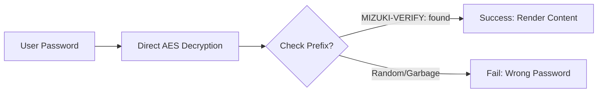

This blog template is built with [Astro](https://astro.build/). For the things that are not mentioned in this guide, you may find the answers in the [Astro Docs](https://docs.astro.build/).

## Front-matter of Posts

```yaml
---
title: My First Blog Post
published: 2023-09-09
description: This is the first post of my new Astro blog.
image: ./cover.jpg
tags: [Foo, Bar]
category: Front-end
draft: false
---
```


| Attribute | Description |
|---------------|-----------------|
| `title`       | The title of the post.|
| `author`      | The author of the post.|
| `published`   | The date the post was published.|
| `description` | A short description of the post. Displayed on index page.|
| `tags`        | The tags of the post.|
| `category`    | The category of the post.|
| `image`       | The cover image path of the post.<br/>1. Start with `http://` or `https://`: Use web image<br/>2. Start with `/`: For image in `public` dir<br/>3. With none of the prefixes: Relative to the markdown file |
| `draft`       | If this post is still a draft, which won't be displayed.|
| `pinned`      | Whether this post is pinned to the top of the post list.|
| `priority`    | The priority of the pinned post. Smaller value means higher priority (0, 1, 2...). |
| `encrypted`   | Whether this post is need a password to view|
| `password`    | The key to view the post|
| `alias`       | The post will be accessible at `/posts/{alias}/`|
| `permalink`   | Generate a permanent link relative to `posts` path. eg: `https://mizuki.site/posts/encrypted-example`|
| `sourceLink`  | The source link or reference for the post content.|
| `licenseName` | The license name for the post content.|


## Where to Place the Post Files


Your post files should be placed in `src/content/posts/` directory. You can also create sub-directories to better organize your posts and assets.

```
src/content/posts/
├── post-1.md
└── post-2/
    ├──img
    |   └── index.md
    ├── cover.webp
```

## Posts alias

You can set a alias for any post by adding the `alias` field to the front-matter:

```yaml
---
title: My Special Article
published: 2024-01-15
alias: "my-special-article"
tags: ["Example"]
category: "Technology"
---
```

When a alias is set:
- The post will be accessible at the custom URL (e.g., `/posts/my-special-article/`)
- The default `/posts/{slug}/` URL will still work
- RSS/Atom feeds will use the custom alias
- All internal links will automatically use the custom alias

**Important Notes:**
- Alias should NOT include `/posts/` prefix (it will be added automatically)
- Avoid special characters and spaces in alias
- Use lowercase letters and hyphens for best SEO practices
- Make sure alias are unique across all posts
- Don't include leading or trailing slashes

## Link multiple articles

To link to multiple articles on the blog page, you can create an article list

```html
<ul>
  <li><a href="/me/">我的第一篇文章</a></li>
  <li><a href="/posts/mizuki-intro/">我的第二篇文章</a></li>
  <li><a href="/posts/markdown-intro/">我的第三篇文章</a></li>
</ul>
```

<ul>
  <li><a href="/me/">我的第一篇文章</a></li>
  <li><a href="/posts/mizuki-intro/">我的第二篇文章</a></li>
  <li><a href="/posts/markdown-intro/">我的第三篇文章</a></li>
</ul>

## How Password Works

